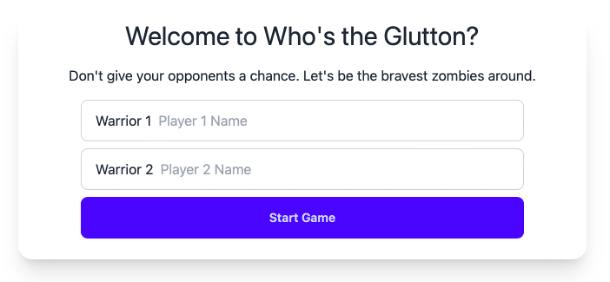
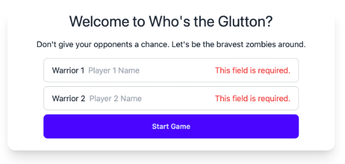
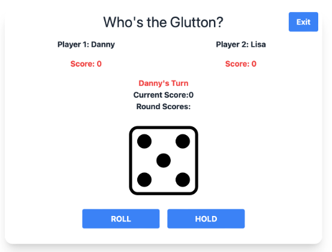
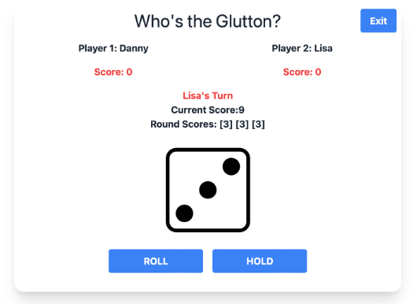
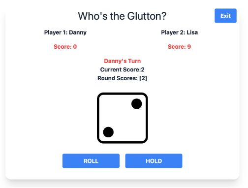

# FSDDiceGame
It's a Dice game project for FSD program mini project.

## Technologies used

- Python
- Flask
- Server Template
- 

## Screenshots

### Start Page

### Start Page form validation

### Play Game page

### Player Roll in the turn

### Player Hold to another player turn 

### Winner page
